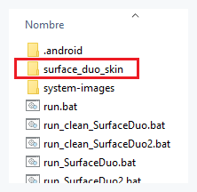
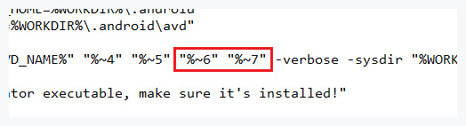
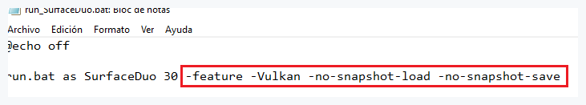
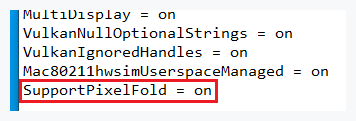
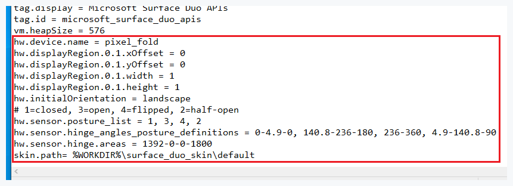
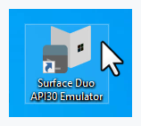
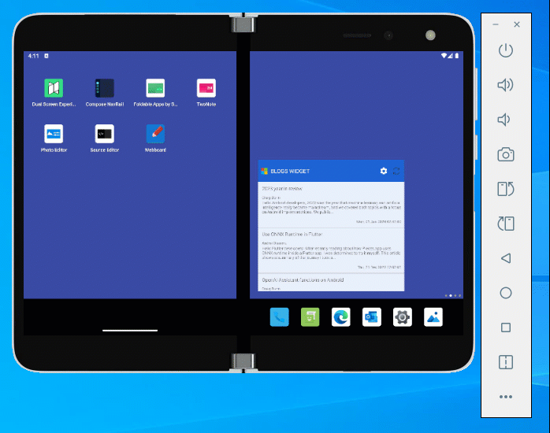
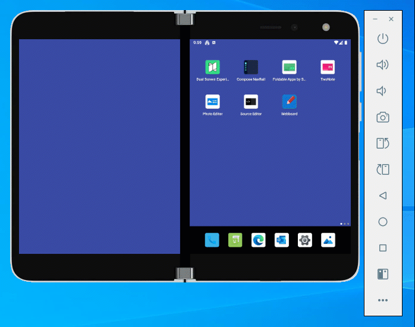

# Skin for Surface Duo

Hi everyone! This tutorial will help you to add a skin for the Surface Duo Emulator (1st Gen). This is a simple but effective workaround. First of all you need to [download & install](https://www.microsoft.com/en-us/download/details.aspx?id=100847) the Surface Duo Emulator from Microsoft. In this tutorial is used the SurfaceDuoEmulator_Android11_2022.523.3_windows.exe file (824.1 MB).
Then you must go to the installation folder (right-click on desktop shortcut and then 'Open file location')

https://github.com/user-attachments/assets/eda92806-f11f-4fba-abd2-467cfdd21fa3

## Installation

Please, follow next steps to install the skin:

1. Copy & paste 'surface_duo_skin' folder into 'artifacts' folder. Download it from [here](https://github.com/PabloAza89/surface-duo-skin/archive/refs/heads/main.zip).

    
    
2. Edit 'run.bat', add: "%~6" "%~7"

    

3. Edit 'run_SurfaceDuo.bat', add: -feature -Vulkan -no-snapshot-load -no-snapshot-save

    

4. Go to 'system-images', edit 'advancedFeatures.ini', add: SupportPixelFold = on

    

5. Go to '.android\avd\Surface_Duo_API_30.avd', edit config.ini, then add next lines to the very bottom of the file:

```bash
hw.device.name = pixel_fold
bash hw.displayRegion.0.1.xOffset = 0
bash hw.displayRegion.0.1.yOffset = 0
hw.displayRegion.0.1.width = 1
hw.displayRegion.0.1.height = 1
hw.initialOrientation = landscape
# 1=closed, 3=open, 4=flipped, 2=half-open
hw.sensor.posture_list = 1, 3, 4, 2
hw.sensor.hinge_angles_posture_definitions = 0-4.9-0, 140.8-236-180, 236-360, 4.9-140.8-90
hw.sensor.hinge.areas = 1392-0-0-1800
skin.path= %WORKDIR%\surface_duo_skin\default
```

    

## Usage

After former steps, just double-click on Surface Duo API30 Emulator shortcut.. and that's it !

    

## Notes

• Next angle range table is an approximation working in concordance with Android Emulator & device's Folding Feature:

| State | From | To | Default |
| ----- | ---- | -- | ------- |
| Closed | 0º | 4.9º | 0º |
| Half-Open | 4.9º | 140.8º | 90º |
| Open | 140.8º | 236º | 180º |
| Flipped | 236º | 360º | 360º |
    
> Note that Folding Feature it's only retrieving data when device is either on Open position (FLAT) or Half-Open position (HALF_OPENED), and the app it's spanned across displays.. otherwise Folding Feature will retrieve empty data (WindowLayoutInfo{ DisplayFeatures[] })

• Volume up, Volume down & Power touchable buttons in the skin are also available:

    

• Screen switch it's only possible in the 'flipped' position: just turn off the screen, turn on again and double-tap the screen to switch it:

    
